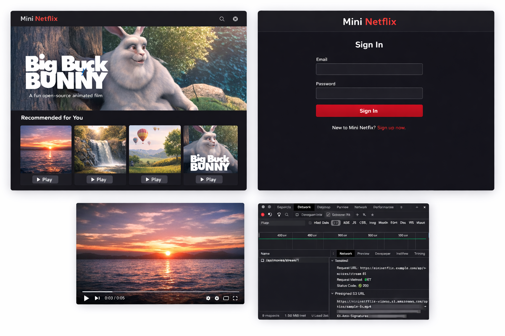

# 🎬 Mini Netflix  
## Production-Grade Modular Monolith on AWS (3-Tier Architecture)

A Netflix-inspired video streaming platform built using a **Modular Monolith backend** and deployed in a **secure AWS 3-Tier architecture**.

This project demonstrates real-world cloud architecture patterns, secure infrastructure design, scalable database setup, and modern frontend implementation.


---

# 📌 Project Objective

The goal of this project is to:

- Build a production-style streaming application  
- Deploy it using secure AWS best practices  
- Implement scalable database architecture (Primary + Read Replica)  
- Secure video streaming using S3 Pre-Signed URLs  
- Follow clean modular backend structure  
- Prepare for Cloud / DevOps / Full Stack interviews  

---

# 🏗 High-Level Architecture

```
Client (Browser)
      │
      ▼
Application Load Balancer (Public Subnet)
      │
      ▼
Frontend EC2 (Private Subnet - Nginx + React)
      │
      ▼
Backend EC2 (Private Subnet - Node.js + Express)
      │
      ▼
Amazon RDS (Primary + Read Replica - Private Subnets)
      │
      ▼
Amazon S3 (Private Bucket - Video Storage)
```

---

# 🔐 Security Architecture

This project follows AWS security best practices.

## Network Isolation

- Only the ALB is public  
- Frontend EC2 runs in private subnet  
- Backend EC2 runs in private subnet  
- RDS runs in private DB subnet  
- S3 blocks all public access  

---

## Security Groups

| Component        | Allowed Traffic                    |
|------------------|-----------------------------------|
| ALB              | 80 / 443 from Internet            |
| Frontend EC2     | From ALB only                     |
| Backend EC2      | Port 4000 from ALB                |
| RDS              | Port 3306 from Backend EC2        |

---

## IAM Role

Backend EC2 must have IAM role attached with:

Minimum required:
```
s3:GetObject
```

Or for development:
```
AmazonS3FullAccess
```

---

## Application-Level Security

- JWT authentication  
- Protected streaming endpoint  
- Signed URL expiry (5 minutes)  

---

# 🚀 Core Features

## 🔑 Authentication System

- User Registration  
- User Login  
- Password hashing using bcrypt  
- JWT token (2-hour expiry)  
- Protected routes  

---

## 🎥 Secure Video Streaming

- Videos stored in private S3 bucket  
- Backend generates Pre-Signed URL  
- URL expires automatically  
- Prevents direct public access  

---

## 📊 Database Scalability

- RDS Primary handles writes  
- RDS Read Replica handles reads  
- Improves performance under load  

---

## 🎨 Modern UI

- Netflix-style dark theme  
- Hero banner  
- Responsive movie grid  
- Hover animations  
- Clean login page  

---

## 🧠 Backend Design

- Modular Monolith structure  
- Domain separation (Auth / Movies)  
- Clean routing layer  
- Config separation  
- Health check endpoint  

---

# 🛠 Technology Stack

## Frontend

- React 18  
- Axios  
- React Router  
- Custom CSS  
- Nginx (static hosting)  

## Backend

- Node.js  
- Express  
- MySQL2  
- JWT (jsonwebtoken)  
- bcryptjs  
- AWS SDK  

## Database

- Amazon RDS MySQL 8  
- Read Replica  

## Storage

- Amazon S3 (Private bucket)  

---

# 📂 Project Structure

```
mininetflix-project/
│
├── backend/
│   ├── package.json
│   └── src/
│       ├── config/
│       │   ├── db.js
│       │   └── s3.js
│       ├── middleware/
│       │   └── auth.middleware.js
│       ├── modules/
│       │   ├── auth/
│       │   │   ├── auth.controller.js
│       │   │   └── auth.routes.js
│       │   ├── movies/
│       │   │   ├── movie.controller.js
│       │   │   └── movie.routes.js
│       ├── app.js
│       └── server.js
│
└── frontend/
    ├── package.json
    └── src/
        ├── api/
        ├── components/
        ├── pages/
        ├── styles/
        ├── App.jsx
        └── index.js
```

---

# 🗄 Database Schema

```sql
CREATE DATABASE mininetflix;

CREATE TABLE users (
  id INT AUTO_INCREMENT PRIMARY KEY,
  name VARCHAR(100),
  email VARCHAR(100) UNIQUE,
  password VARCHAR(255),
  role ENUM('admin','user') DEFAULT 'user'
);

CREATE TABLE movies (
  id INT AUTO_INCREMENT PRIMARY KEY,
  title VARCHAR(255),
  description TEXT,
  video_key VARCHAR(255)
);
```

---

# ⚙️ Backend Setup

### Step 1: Install Dependencies

```bash
cd backend
npm install
```

### Step 2: Create `.env`

```env
DB_PRIMARY_HOST=your-primary-endpoint
DB_REPLICA_HOST=your-replica-endpoint
DB_USER=admin
DB_PASS=password
DB_NAME=mininetflix

JWT_SECRET=supersecretkey
AWS_REGION=ap-south-1
S3_BUCKET=your-bucket-name
PORT=4000
```

### Step 3: Start Server

```bash
npm start
```

### Step 4: Health Check

Visit:

```
http://localhost:4000/health
```

Expected response:

```
OK
```

---

# 🎨 Frontend Setup

### Step 1

```bash
cd frontend
npm install
```

### Step 2

```bash
npm run build
```

### Step 3 (Frontend EC2 Deployment)

```bash
sudo rm -rf /usr/share/nginx/html/*
sudo cp -r build/* /usr/share/nginx/html/
sudo systemctl restart nginx
```

---

# 🌐 ALB Routing Configuration

| Path Pattern | Target Group |
|--------------|--------------|
| `/api/*`     | Backend      |
| `/*`         | Frontend     |

---

# 🔄 Request Flow

## Login Flow

Frontend → `/api/auth/login` → Backend → RDS Primary → JWT returned  

## Fetch Movies

Frontend → `/api/movies` → Backend → RDS Read Replica → JSON response  

## Stream Movie

Frontend → `/api/movies/stream/:id`  
Backend verifies JWT → Generates S3 Signed URL → Video plays securely  

---

# 🧪 Testing Checklist

- Backend starts successfully  
- `/health` returns OK  
- Login returns JWT  
- Movies endpoint returns JSON  
- Streaming endpoint returns signed URL  
- Video plays successfully  
- RDS replica used for reads  
- Security groups properly configured  

---

# 🏆 Interview Explanation (Senior-Level)

This application follows a modular monolithic architecture deployed within a secure AWS 3-tier environment. Business domains are separated internally while deployed as a single scalable unit. Read traffic is offloaded to an RDS Read Replica, and secure streaming is achieved using S3 Pre-Signed URLs. All infrastructure components except the ALB are deployed in private subnets following least-privilege security principles.

---

# 📈 Future Enhancements

- Auto Scaling Group  
- HTTPS via ACM  
- CloudFront CDN  
- Redis (ElastiCache)  
- Centralized logging  
- Docker containerization  
- ECS migration  
- CI/CD pipeline  
- Monitoring via CloudWatch  

---

## 🛠 Tech Stack


---

# 👨‍💻 Author

**Anil Jadhav**  
AWS | DevOps | Full Stack Developer  